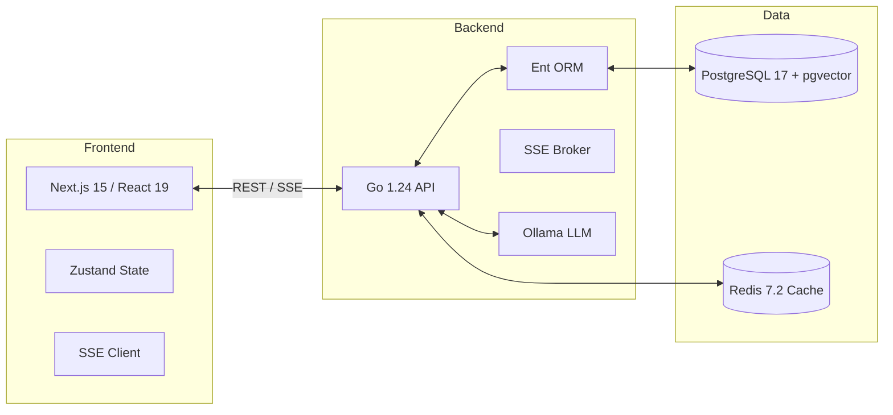

# System Architecture

## Overview
Game Stats is a high-performance, real-time tournament management platform. It uses a **Polyglot** architecture with **Go** for performance and **Next.js** for a rich UI experience.

---

## Technical Stack

---

## Key Architectural Decisions

### 1. Server-Sent Events (SSE) vs WebSockets
We chose **SSE** for live score updates because:
- Most traffic is unidirectional (Server to many Spectators).
- It handles reconnections automatically.
- It works seamlessly over HTTP/2.

### 2. Ent ORM for Go
We use **Ent** because it treats the schema as code, providing:
- Type-safe queries.
- Graph-based traversals (essential for complex tournament structures).
- Automated migration management.

### 3. Hybrid AI Engine
- **pgvector**: Stores semantic embeddings of players and stats.
- **Ollama (duckdb-nsql)**: Converts natural language into SQL queries locally, ensuring privacy and low latency.

---

## Deployment Topology
- **API Nodes**: Stateless Go containers (scaled via K8s HPA).
- **Dashboard**: Next.js App Router (Vercel or Docker).
- **Real-time**: Redis Pub/Sub coordinates SSE events across multiple API instances.

---

## Security
- **Authentication**: JWT with Refresh Tokens.
- **Authorization**: Granular role-based access (RBAC) defined in the Go backend.
- **Data Protection**: AES-256 for sensitive PII; TLS 1.3 for all traffic.
