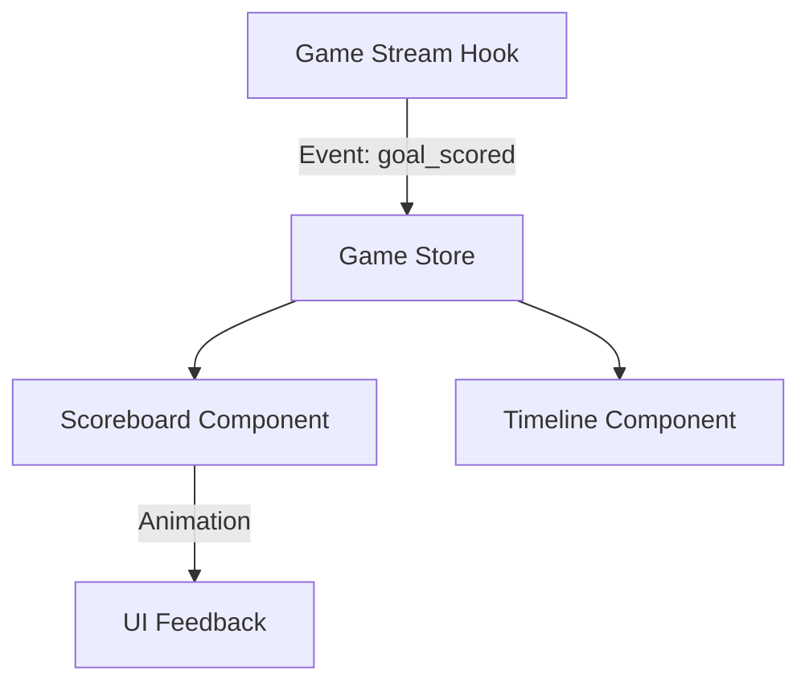

# Component Architecture

## Overview
Game Stats UI uses a **feature-based architecture** combined with Next.js 15 App Router conventions. This ensures high maintainability and performance through React Server Components (RSC).

---

## Component Categories

### 1. UI Infrastructure (`/components/ui`)
Original or modified **shadcn/ui** primitives.
- `Button.tsx`, `Dialog.tsx`, `Card.tsx`, `Skeleton.tsx`, etc.

### 2. Feature Components (`/components/features`)
Business logic and feature-specific UI.
- `features/games/ScoreBoard.tsx`
- `features/brackets/BracketTree.tsx`
- `features/analytics/PromptInput.tsx`

### 3. Layout Components (`/components/layout`)
Application shell and navigation.
- `Header.tsx`, `Sidebar.tsx`, `MainLayout.tsx`.

---

## Data Fetching & State Strategy

### React Server Components (RSC)
- Used for `List` and `Detail` views (e.g., Team List, Game Overview).
- Fetch data directly from the Go API using `fetch()` with appropriate caching headers.

### Client Components
- Used for **Interactive** elements.
- Real-time Scoreboard (SSE connection).
- Timer controls.
- Analytics prompt interactions.
- Form submissions (React Hook Form).

### Global State (Zustand)
- **`useAuthStore`**: User session, role, and permission cache.
- **`useGameStore`**: Temporary client-side game state for scorekeeping.
- **`useConfigStore`**: Dark mode, local preferences.

---

## SSE Pattern Implementation

Components use the `useGameStream` hook (documented in `PLAN.md`) to subscribe to game updates.

---

## Advanced Visuals

### Brackets
- Implemented using `@react-sigma/core` or custom SVG paths for absolute performance.
- Nodes are Client Components to allow interactive drill-down.

### Charts
- **Tremor** is used for the majority of stats.
- Higher-level analytics use **Metabase** embedded iframes for production-grade depth.

---

## PWA Strategy
- Service Worker handles caching of assets.
- Critical data (Rosters) is cached in IndexedDB (via `dexie` or simple Map) for offline scorekeeping support.
